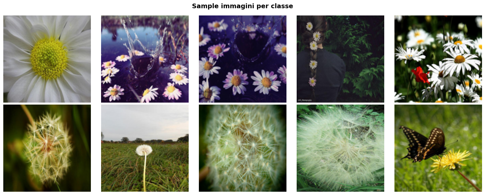
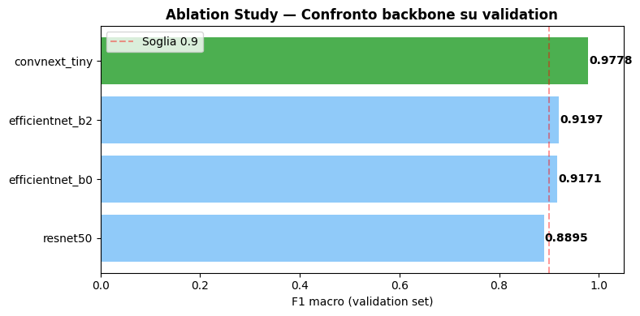
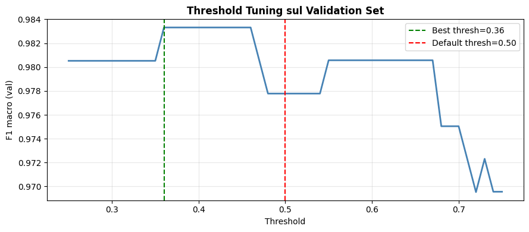
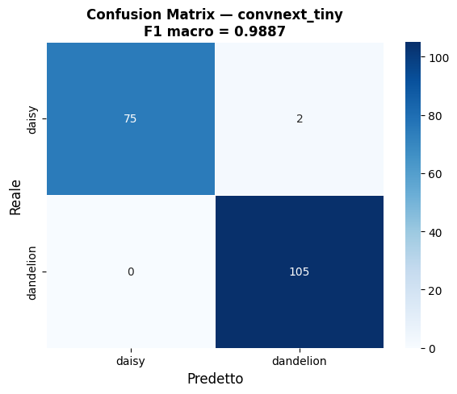
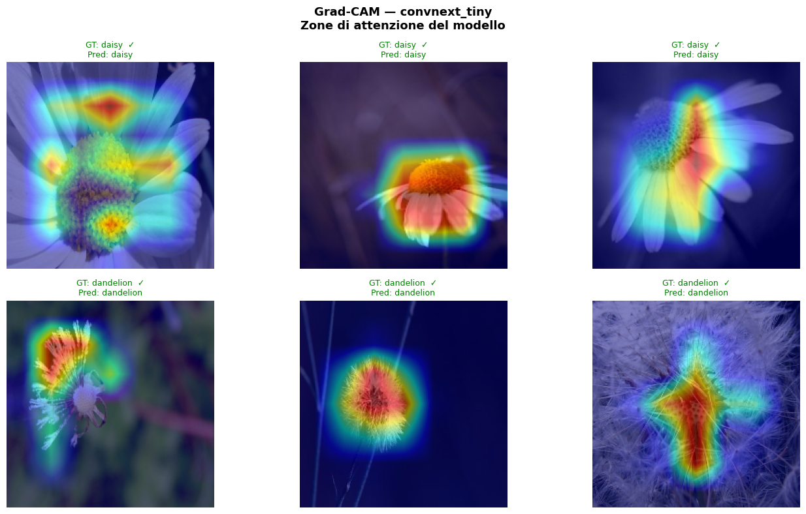

# 🌸 Flower Recognition — Deep Learning Computer Vision

A deep learning project for **flower image classification** using PyTorch and Transfer Learning.

The goal of the project is to build a robust computer vision pipeline capable of distinguishing between **Daisy** and **Dandelion** flowers using modern convolutional neural networks.

The project explores multiple architectures, model calibration, interpretability techniques, and inference improvements.

---

# Project Overview

The system implements a complete machine learning pipeline:

* Transfer learning with multiple CNN architectures
* Ablation study across different backbones
* Threshold tuning for optimal F1-score
* Model calibration analysis
* Grad-CAM interpretability
* Test Time Augmentation (TTA)

The objective metric for model selection is **F1 Macro Score**.

---

# Dataset

The dataset contains **1,821 RGB images** of two flower species:

| Class     | Train | Validation | Test |
| --------- | ----- | ---------- | ---- |
| Daisy     | 529   | 163        | 77   |
| Dandelion | 746   | 201        | 105  |

Total images: **1821**

Example samples from the dataset:



---

# Model Architectures Tested

The project compares multiple modern CNN backbones:

* ResNet50
* EfficientNet-B0
* EfficientNet-B2
* ConvNeXt-Tiny

Validation results:



ConvNeXt-Tiny achieved the best validation performance.

---

# Threshold Optimization

Instead of using the default classification threshold (0.5), the optimal threshold was determined using the validation set.



Best threshold found: **0.36**

---

# Final Model Performance

The final model achieved the following results on the **test set**:

* **F1 Macro:** 0.9887
* **Calibration Error (ECE):** 0.0301

Confusion matrix:



---

# Model Interpretability

Grad-CAM was used to visualize the regions of the image that most influenced the model predictions.

This allows verification that the model focuses on **biologically relevant parts of the flower** rather than background artifacts.



---

# Tech Stack

* PyTorch
* PyTorch Lightning
* timm
* Albumentations
* scikit-learn
* Grad-CAM

---

# Repository Structure

```
flower-recognition-cnn
│
├── notebook
│   └── flower_recognition.ipynb
│
├── report
│   └── flower_recognition_report.pdf
│
├── images
│   ├── dataset_samples.png
│   ├── class_distribution.png
│   ├── ablation_study.png
│   ├── threshold_tuning.png
│   ├── confusion_matrix.png
│   ├── reliability_diagram.png
│   └── gradcam_examples.png
│
├── requirements.txt
└── README.md
```

---

# Running the Project

Install dependencies:

```
pip install -r requirements.txt
```

Open the notebook:

```
jupyter notebook notebook/flower_recognition.ipynb
```

Run all cells to reproduce the training and evaluation pipeline.

---

# Future Improvements

Possible extensions include:

* multi-class flower classification
* Vision Transformer architectures
* temperature scaling for improved calibration
* deployment with ONNX for edge inference
